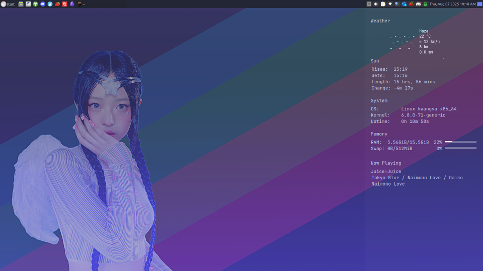
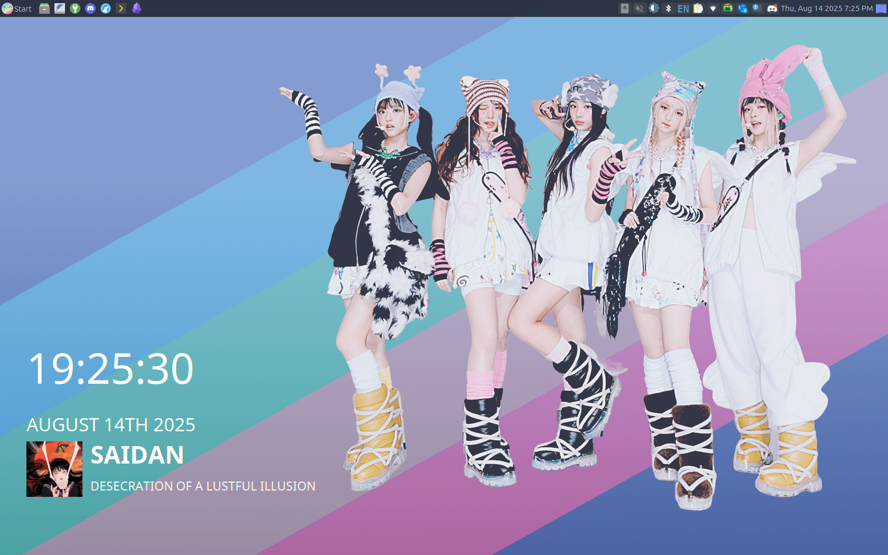

# my dotfiles

 

 

	
	 
	
	

## info

my distro of choice is [lubuntu](https://lubuntu.me/), less because it's good, and more because i'm used to it. i do like the LXQt desktop environment though, and have extensively customized it to fulfill my need to use [catppuccin](https://github.com/catppuccin/lxqt) everywhere.

speaking of catppuccin, my preferred flavor is frappe (but sometimes i'll use latte). i generally like cute things in any form and love to make my weird computer nerd things as cute as possible.

## CLI and/or TUI program recs

some essential programs i use
- [micro](https://github.com/zyedidia/micro) - my main text editor and the only one in the fucking world with sensible keybindings
- [mpv](https://mpv.io/) - classic multimedia player
- [mullvad](https://mullvad.net/en/help/how-use-mullvad-cli) - VPN
- [magic-tape](https://gitlab.com/christosangel/magic-tape) - use and watch youtube
- [fzf](https://github.com/junegunn/fzf) - fuzzy finder
- [glow](https://github.com/charmbracelet/glow) - (very cute) markdown reader
- [gum](https://github.com/charmbracelet/gum) - make your scripts adorable AND interactive, c'mon people!!!
- [pandoc](https://pandoc.org/) - document conversion
- [gallery-dl](https://github.com/mikf/gallery-dl) - download web images in bulk
- [yt-dlp](https://github.com/yt-dlp/yt-dlp) - download videos

...and here's some more related programs i like a lot
- [min](https://github.com/a-h/min) - gemini browser
- [epy](https://github.com/wustho/epy) - ePub reader
- [mklicense](https://github.com/cezaraugusto/mklicense) - generate open source license with customized details (as prompted)
- [asciinema](https://github.com/asciinema/asciinema) - record terminal
- [pastel](https://github.com/sharkdp/pastel/) & [xcolor](https://soft.github.io/xcolor/) - just for the screen color picking functionality. i could use xcolor on its own but pastel gives a neat graphic for the color and the RGB and HSL values along with the hex code. i aliased this to "pick"
- [slides](https://github.com/maaslalani/slides) - markdown-powered terminal slides
